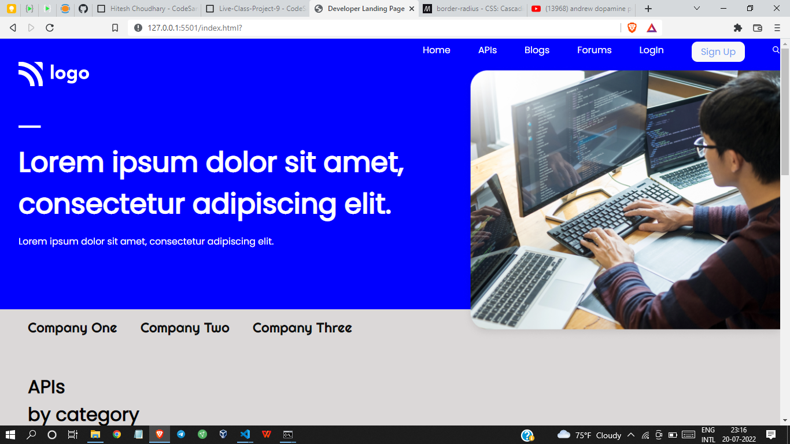

# Project 9 - HTML  and CSS 

By Shreesha

# What did I learn in this project

- This project took most of the time but was worth spending. Got to learn many things.
- I got to learn about the   positioning of images 
- Got to learn about the flexbox.
- got to learn how to design buttons and navbar
- Also got to play with background images.

## Time taken to complete project is 6 hours
